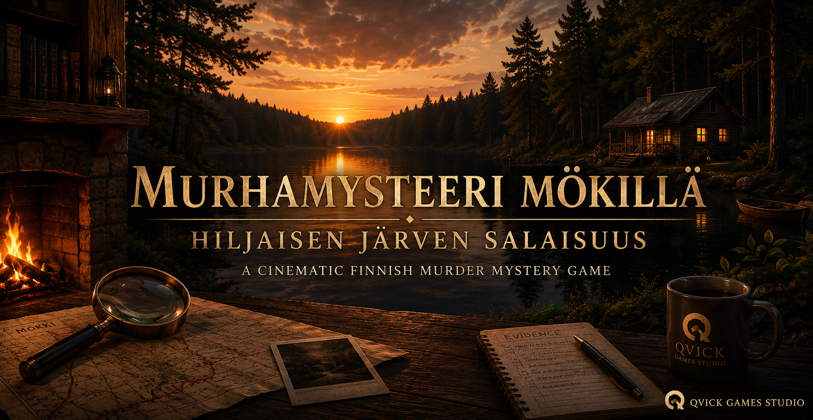

  

# Murhamysteeri mökillä – Hiljaisen järven salaisuus

 🚧 Current Status: In Active Development • Regular Updates

 🇫🇮 Finnish cinematic murder mystery browser game developed by **Qvick Games Studio**.

---

## About the game

A group of people gathers at a quiet Finnish lakeside cabin. During the night, the peaceful visit turns into a murder investigation.

The player takes the role of an investigator and must:

- explore the cabin and its surroundings
- discover hidden clues
- examine evidence
- question suspects
- compare testimonies and contradictions
- make the final accusation

The game focuses on atmosphere, environmental storytelling and player deduction rather than fast-paced action.

---

## Main features

- Cinematic Finnish lakeside setting
- Interactive location exploration
- Clickable investigation hotspots
- Evidence and clue collection
- Suspect interrogation system
- Investigation board
- Final deduction and accusation
- Finnish and English language support
- Responsive desktop and mobile interface
- Local save system
- Ambient sound and weather effects

---

## Current locations

- Living Room
- Kitchen
- Antti's Room
- Sauna
- Boathouse
- Old Storage Building
- Pier
- Lakeside Path
- Forest Path
- Parking Area

---

## Main suspects

- Elina Koskinen
- Markus Salo
- Laura Niemi
- Oskari Mäkelä
- Sara Virtanen

Each suspect has their own connection to the victim, personal motives and an alibi that the player must investigate.

---

## Technology

- React
- TypeScript
- Vite
- HTML
- CSS
- LocalStorage
- Google AI Studio
- GitHub

---

## Development goals

The goal is to create a polished and atmospheric Finnish detective experience that combines:

- narrative game design
- environmental storytelling
- investigation mechanics
- cinematic visual presentation
- meaningful player decisions

This project is also part of my ongoing game development studies and portfolio work.

---

## Developer

**Jani-Petteri Qvick**  
Founder and Game Developer at **Qvick Games Studio**

Main interests:

- Game Design
- Level Design
- Environment Design
- Narrative Design
- Unity Development
- React and TypeScript
- AI-assisted development

---

## Project status

The project is currently under active development.

New locations, clue images, suspect portraits, interrogation features and deduction mechanics are being added and refined.

---

## License

This project and its original game content are created by Qvick Games Studio.

All rights reserved unless otherwise stated.
